# 🍽️ AI-Powered Restaurant Review Analyzer

A **n8n workflow** that automatically analyzes restaurant reviews in multiple languages and provides detailed scoring across 5 key points: **Food, Service, Environment, Value, Overall**. Built with **Ollama LLM models** for accurate sentiment analysis and translation capabilities.

## 🌟 Key Features

- **Multi-Language Support**: Automatically detects and translates Chinese, English, and other languages
- **5-Dimensional Analysis**: Food, Service, Environment, Value, Overall ratings (1-10 scale)
- **Intelligent Scoring**: Context-aware rating system that properly weighs service failures, food safety issues, and customer loyalty impact
- **Batch Processing**: Analyze multiple reviews simultaneously by separated lines
- **Real-time Chat Interface**: Interactive web-based chat for instant analysis
- **Business-Ready Insights**: Scores designed to help restaurant managers identify critical issues and success patterns

## 📊 Sample Results

### Cantonese Service Incident

**Input**: "個侍應態度好差... "

**Output**: `Food: N/A | Service: 2/10 | Environment: N/A | Value: N/A | Overall: 2/10` ✅ (Correctly identifies severe service failure)

### English Fine Dining Experience

**Input**: "Stunning harbor views, quality sushi, truffle risotto, friendly staff..."

**Output**: `Food: 9/10, Service: 8/10, Environment: 10/10, Value: 7/10, Overall: 9/10` ✅

## 🛠️ Setup Instructions

### Prerequisites

- **Docker Desktop** installed and running
- **8GB+ free disk space** for LLM models

### Step 1: Install Ollama

#### Download and install from https://ollama.com/download

### Step 2.1: Download llama3.1:8b Model

```
# download required models
ollama pull llama3.1:8b
```
### Step 2.2: Start Ollama as an API
```
# Start Ollama service
ollama serve
```

### Step 3: Start n8n with Docker

Use or create `docker-compose.yml`:

```yaml
# docker-compose.yml
services:
  n8n:
    image: n8nio/n8n
    container_name: n8n
    ports:
      - "5678:5678"
    environment:
      - N8N_HOST=localhost
      - N8N_PORT=5678
      - WEBHOOK_URL=http://localhost:5678
      - NODE_FUNCTION_ALLOW_EXTERNAL=*
    volumes:
      - n8n_data:/home/node/.n8n
volumes:
  n8n_data:
```

```
# Start n8n
docker-compose up -d
```

### Step 4: Access n8n Interface

1. Open browser and go to `http://localhost:5678`
2. Create a local n8n account `demo1234@example.com` `Demo` `1234` `Demo1234`
3. Complete the initial setup

### Step 5: Configure Ollama Connection

1. In n8n, go to **Settings** → **Credentials**
2. Add **Ollama API** credential:
   - **Host**: `http://host.docker.internal:11434` (Windows/Mac)
   - **Host**: `http://172.17.0.1:11434` (Linux)
3. Test the connection

### Step 6: Import the Workflow

1. In n8n, click **New Workflow**
2. Click the **3-dot menu** → **Import from JSON**
3. Paste the workflow JSON from your project files
4. **Save** the workflow
5. **Activate** the workflow

## 🚀 How to Use

### Single Comment Analysis

Send a single restaurant comment in the chat:

```
The pasta was amazing but service was slow
```

### Multi-Comment Analysis

Send multiple comments separated by newlines:

```
Great food but expensive
個侍應態度好差
Terrible experience, food poisoning
Beautiful view, worth the price
```

### Expected Response Format

```
📊 Restaurant Rating (4 comments)

Comment 1: Food: 8/10 | Service: N/A | Environment: N/A | Value: 2/10 | Overall: 6/10

Comment 2: Food: N/A | Service: 2/10 | Environment: N/A | Value: N/A | Overall: 2/10

Comment 3: Food: 1/10 | Service: 1/10 | Environment: N/A | Value: N/A | Overall: 1/10

Comment 4: Food: N/A | Service: N/A | Environment: 9/10 | Value: 8/10 | Overall: 9/10
```

## 🧠 Scoring Logic

### Rating Scale

- **8-10**: Positive experiences (good=8, excellent=9-10)
- **4-7**: Neutral/average experiences
- **1-3**: Negative experiences (bad=1-2, terrible=1)
- **N/A**: Aspect not mentioned in the comment

### Critical Scoring Rules

- **Food poisoning/illness**: Automatic 1-2 rating
- **Service failures**: Major deductions for poor complaint handling
- **Loyal customer disappointment**: Maximum 1-2 points
- **Multiple failures**: Compound negative impact

### Categories Analyzed

1. **Food**: Taste, quality, presentation, freshness, cooking
2. **Service**: Staff friendliness, speed, attentiveness, professionalism
3. **Environment**: Atmosphere, cleanliness, noise level, ambiance
4. **Value**: Price vs quality ratio, portion sizes, worth
5. **Overall**: Would recommend/return, satisfaction level

## ⚙️ Technical Architecture

### WorkFlow diagram

```mermaid
graph LR
    A[📝 Raw Comments] --> B{🔍 Language Detection<br/>Regex Pattern}
    B -->|English Match| C[✅ English Path]
    B -->|Non-English| D[🌏 Translation Path]

    C --> E[📋 processedComment = original]
    D --> F[🤖 Translator AI]
    F --> G[📋 processedComment = translated]

    E --> H[📊 Rating Analysis]
    G --> H

    class C,E english
    class D,F,G translate
    class A,B,H process
```



### AI Models Used

- **Translation Model**: `llama3.1:8b` (300 tokens, high accuracy)
- **Rating Model**: `llama3.1:8b` (30 tokens, optimized for speed)

## 📝 License

This project is open source and available under the MIT License.

---

**Built with ❤️ using docker, n8n, Ollama, and llama3.1:8b**
